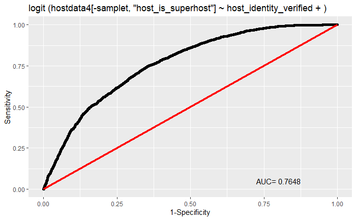
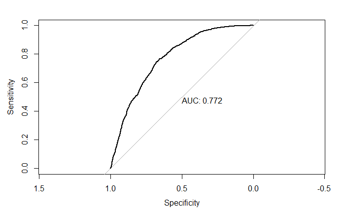
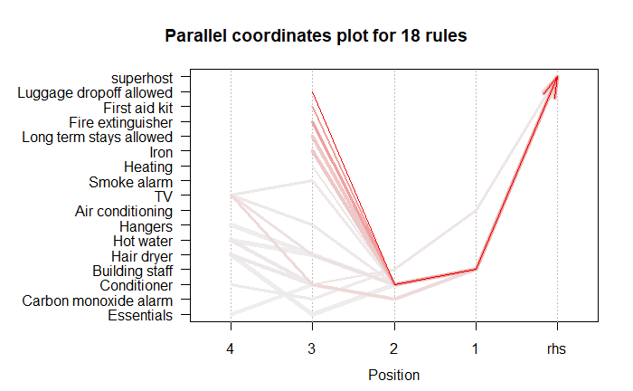

---
output:
  pdf_document: default
  html_document: default
---
# **Superhost Model**

*Superhost* are experienced hosts who provide a shining example for other hosts, and extraordinary experiences for their guests. Once they are called Superhosts, and their listings feature a special badge that let everyone know they are extra awesome. Although the airbnb websites have posted out the standards of becoming a superhost. We still want to dig out important information from the data analysis, and then provide every host with insights about how to increase the probability of becoming a superhost. 

The _host_is_superhost_ is a binary variable, which takes the values of "True" or "False". Thus, we use logistic regression to build our model. And We select _14_ variables which is potentially related to the superhost. After excluding missing data, we ended up with 14,058 observations. We didn't include the _comments_ and _amenities_ variables, which are text information and will be analyazed by different model.

## Logistic Regression

First, we tested the correlation between covariates, and found that there existed high correlation among same prefix variables. Since these variables contain different underlying information, we use *Principle Component Analysis* (PCA) to overcome the multicollinearity problem and extracting dominant patterns in a group of predictor.

We randomly split the observations into training set and test set at a ratio of 7:3. Since we didn't know which variables should be selected, we dumped all variables into the regression model, and filtered out the appropriates variables according to the real situation and  *Akaike information criterion* (AIC).

## Associating Rule Mining

The _ammenities_ is a text variable, containing a list of amenities of the house or department. We assume that there are some association between the availability of certain amenities and the superhost. In order to dig out the information behind the sets of items, we borrow the algorithm *Association Rule* from business field. Given a set of data, we can find the rules that will predict the occurrence of superhost based on the occurrences of amenities in the list.

We use *Apriori Algorithm* to generate association rules from the amenities and superhost. The Apriori algorithm employs level-wise search for frequent itemsets. It works by eliminating itemsets by looking first at smaller sets and recognizing that a large set cannot be frequent unless all its subsets are. Put simply, the algorithm states that if an itemset is infrequent, then all its subsets must also be infrequent.

* $X$ is called antecedent or left-hand-side (LHS).
* $Y$is called consequent or right-hand-side (RHS)
* Support: The frequency of A in the dataset.$Supp(X) = \frac{Freq(X)}{T}$
* Confidence: The frequency of items X and Y occur together in the dataset when the occurrence of X is already given. $Confidence = \frac{Freq(X,Y)}{Freq(X)}$
* Lift: The ratio of the observed support measure and expected support if X and Y are independent of each other. $Lift=\frac{Supp(X,Y)}{{Supp(X)}\times{Supp(X)}}$
  * $Lift=1$ : The probability of occurrence of antecedent and consequent is independent of each other.
  * $Lift>1$ : It determines the degree to which the two itemsets are dependent to each other.
  * $Lift<1$ :  It tells us that one item is a substitute for other items, which means one item has a negative effect on another.
 
In the amenities, there are over 1400 items. In order to find what amenities sets appear most frequently given that the host is a superhost, we set the maximum length of rules to 10, and limit the confidence level to 0.8, and then rank the rules by lift in descending order. Finally, we find that if the apartment has building staff and conditioner, the host is likely to be a superhost.

